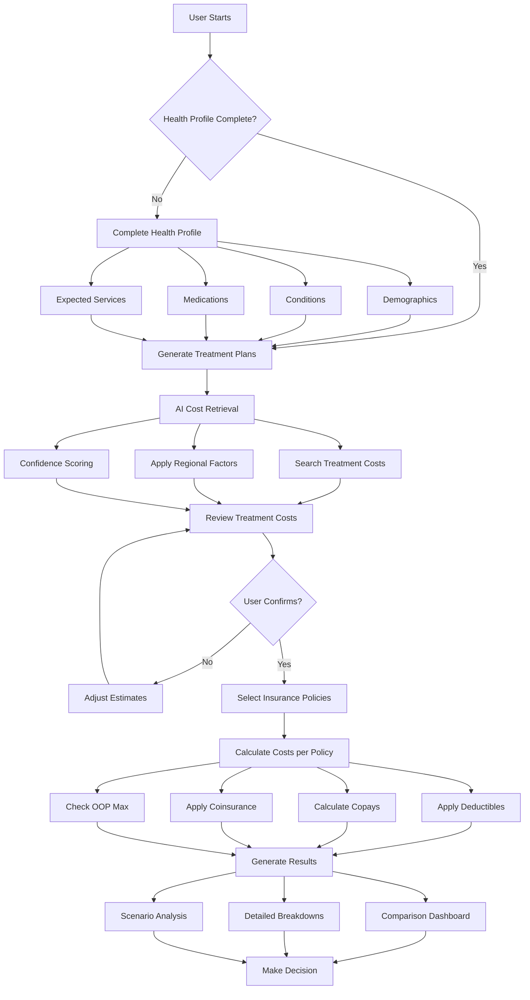

# Cost Analysis User Flow

## Visual Flow Diagram



## Detailed User Journey

### Stage 1: Profile Validation
**Goal**: Ensure comprehensive health data

1. **Entry Point**
   - User clicks "Compare Insurance Costs"
   - System checks profile completeness
   - Shows completion score and missing items

2. **Profile Requirements**
   - ✅ All demographic fields
   - ✅ Medical conditions with severity
   - ✅ Current medications with dosages
   - ✅ Expected medical services
   - ✅ Lifestyle factors for risk assessment

3. **Validation Messages**
   ```
   "Your profile is 75% complete. To get accurate cost estimates, please add:
   - Current medications
   - Expected medical services for next year"
   ```

### Stage 2: Treatment Plan Generation
**Goal**: Convert health profile into specific medical services

1. **Automated Mapping**
   ```
   Diabetes Type 2 → 
   - Endocrinologist visits (4x/year)
   - A1C tests (4x/year)
   - Eye exam (1x/year)
   - Metformin prescription (12x/year)
   - Test strips (12x/year)
   ```

2. **User Customization**
   - Adjust visit frequencies
   - Add/remove services
   - Specify preferred providers

### Stage 3: Cost Intelligence
**Goal**: Get real-world pricing

1. **AI-Powered Search**
   ```
   Query: "Average cost endocrinologist visit [ZIP code] 2024"
   Result: $275-350 per visit (High confidence)
   
   Query: "Metformin 1000mg monthly cost generic"
   Result: $4-15 per month (High confidence)
   ```

2. **Cost Presentation**
   ```
   Your Estimated Annual Medical Costs:
   
   Diabetes Management:
   - Specialist visits: $1,200 ($300 x 4)
   - Lab tests: $600 ($150 x 4)
   - Medications: $180 ($15 x 12)
   Subtotal: $1,980
   
   Preventive Care:
   - Annual physical: $200
   - Dental cleanings: $300 ($150 x 2)
   Subtotal: $500
   
   Total Estimated: $2,480
   [Adjust Estimates]
   ```

### Stage 4: Policy Analysis
**Goal**: Calculate actual out-of-pocket costs

1. **Policy Selection**
   - Pre-loaded from previous analysis
   - Add new policies
   - Include employer contributions

2. **Cost Calculation Display**
   ```
   Policy A: Blue Cross PPO
   Annual Premium: $4,800 ($400/month)
   
   Your Costs:
   - Until deductible ($1,500): You pay 100%
   - After deductible: You pay 20%
   - Copays: $30 PCP, $60 Specialist
   
   Expected Annual Cost: $6,890
   ├── Premiums: $4,800
   ├── Deductible: $1,500
   ├── Copays: $420
   └── Coinsurance: $170
   ```

### Stage 5: Results & Decision
**Goal**: Enable informed decision-making

1. **Comparison View**
   ```
   Side-by-Side Comparison
   
   |                | Policy A    | Policy B    | Policy C    |
   |----------------|-------------|-------------|-------------|
   | Monthly Cost   | $574        | $492        | $625        |
   | Annual Total   | $6,890      | $5,900      | $7,500      |
   | Deductible     | $1,500      | $3,000      | $500         |
   | Your Doctors   | All In-Net  | 3/4 In-Net  | All In-Net  |
   | Best For       | Moderate Use| Low Use     | High Use    |
   ```

2. **Scenario Tools**
   - "What if I need surgery?" → Adds $15,000 procedure
   - "What if I get pregnant?" → Adds maternity costs
   - Shows impact on each policy

## Key UI Components

### 1. Cost Confidence Indicator
```
Endocrinologist Visit: $300
[████████░░] 80% confidence
Source: Average of 5 local providers (Updated: Jan 2024)
```

### 2. Running Cost Calculator
```
As you build your profile:
Estimated Annual Healthcare Costs: $2,480
├── Conditions: $1,980
├── Preventive: $500
└── [Add more services]
```

### 3. Savings Opportunities
```
💡 Potential Savings:
- Generic medications could save $240/year
- Mail-order pharmacy could save $120/year
- Preventive care is 100% covered
```

### 4. Decision Helper
```
Based on your profile:
✓ Policy B offers lowest total cost
✓ Policy A keeps all your doctors
✗ Policy C exceeds your budget

[See detailed analysis]
```

## Error Handling

1. **Incomplete Profile**
   - Clear indication of missing items
   - Partial analysis with warnings
   - Easy navigation to complete

2. **Cost Uncertainty**
   - Show confidence ranges
   - Provide manual override
   - Explain estimation method

3. **Complex Cases**
   - Flag for human review
   - Provide advisor contact
   - Save progress for later